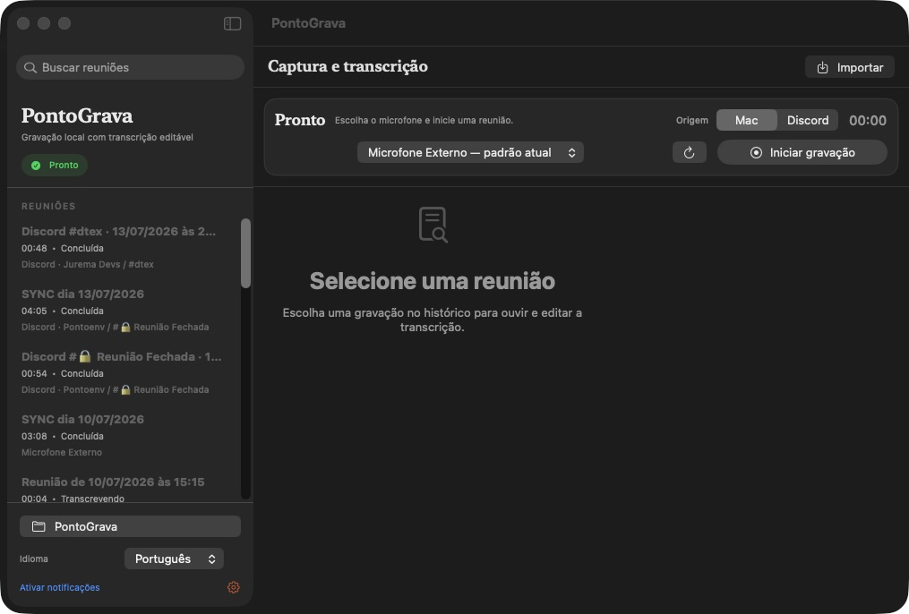
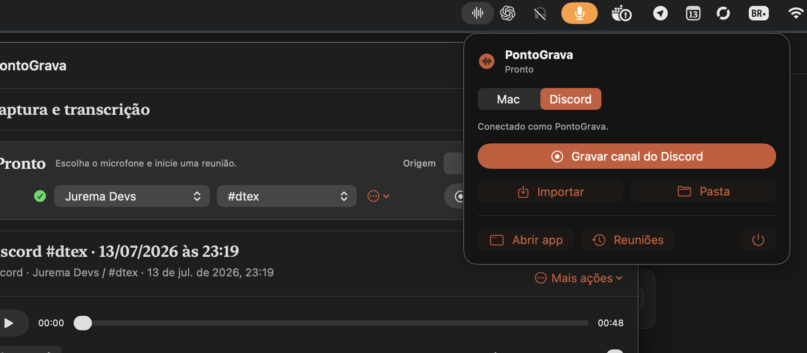

<p align="center">
  
</p>

# PontoGrava

Aplicativo para macOS que grava reuniões no Mac ou em canais de voz do Discord e
gera `audio.wav` mais uma transcrição editável. A captura, o processamento e o
Whisper executam localmente no computador.

- Captura simultânea do áudio do sistema e do microfone.
- Gravação de canais do Discord com identificação dos participantes.
- Soundwave e cronômetro em tempo real.
- Transcrição local com WhisperKit e seleção de idioma.
- Resumo local editável com trabalho realizado, decisões e pendências.
- Histórico com reprodução, edição, retranscrição e acesso pelo Finder.
- Importação de arquivos de áudio já existentes.

## Interface

### Área de trabalho unificada

<p align="center">
  
</p>

A janela principal reúne o histórico pesquisável, a configuração da gravação, o
player e a transcrição editável. Em janelas menores, o gravador vira uma faixa
compacta no topo e deixa o espaço restante para ouvir e revisar a reunião.

### Barra de menus

<p align="center">
  
</p>

O popup permite alternar entre gravação no Mac e no Discord sem abrir a janela
principal. No modo Discord, também é possível escolher o servidor e o canal;
durante uma gravação, o mesmo painel mostra duração, níveis e ações de
pausar, continuar ou parar.

## Baixar e instalar

### Requisitos

- Mac com Apple Silicon.
- macOS 15 ou mais recente.
- Internet no primeiro uso para baixar o modelo Whisper.
- Para gerar resumos: macOS 26.1 ou mais recente com Apple Intelligence ativado.
- Para gravar o Discord: Node.js 22.12 ou mais recente e FFmpeg.

Swift e Xcode **não são necessários** para instalar a versão pronta.

### Instalação

1. Abra a página de [releases](https://github.com/Azinth/PontoGrava/releases/latest).
2. Baixe `PontoGrava.app.zip` na seção **Assets**.
3. Abra o ZIP e arraste `PontoGrava.app` para a pasta **Aplicativos**.
4. Na primeira execução, clique com o botão direito no app e escolha **Abrir**.

O release atual usa assinatura local e ainda não é notarizado pela Apple. Se o
macOS bloquear a abertura, tente abrir o app uma vez e depois acesse **Ajustes do
Sistema → Privacidade e Segurança → Abrir Mesmo Assim**. Baixe o aplicativo
somente pela página oficial de releases deste repositório.

### Permissões do macOS

Na primeira gravação pelo Mac, autorize:

- **Microfone**, para capturar sua voz.
- **Gravação de Tela e Áudio do Sistema**, para capturar a reunião reproduzida no Mac.
- **Notificações** é opcional e serve para avisar quando a transcrição terminar.

As permissões podem ser revisadas em **Ajustes do Sistema → Privacidade e
Segurança**. Se alterar a permissão de áudio do sistema, feche e abra o
PontoGrava novamente.

## Gravar uma reunião no Mac

1. Abra o PontoGrava e selecione o modo **Mac**.
2. Escolha o microfone e o idioma da transcrição.
3. Clique em **Iniciar gravação**.
4. Use **Pausar** quando necessário ou **Parar e transcrever** ao terminar.

O app combina sistema e microfone no mesmo WAV. As pausas são removidas do
áudio, da duração e dos timestamps da transcrição.

## Gerar resumos com IA

Depois da transcrição, abra a aba **Resumo** e clique em **Gerar resumo**. O
PontoGrava usa a versão editada de `transcricao.txt` e o modelo local do Apple
Intelligence para criar um `resumo.md` também editável. Português do Brasil
(`pt_BR`) e inglês (`en_US`) são selecionados conforme o idioma da transcrição.

Por padrão, o resumo registra **O que foi feito** por cada participante, **O que
foi definido** na reunião e **O que está pendente**, sem inventar decisões,
responsáveis ou prazos. Em **Prompt padrão**, você pode ativar e salvar
instruções próprias para escolher outro formato ou foco; a transcrição e o
idioma são adicionados automaticamente ao prompt.

A geração automática fica desativada por padrão e pode ser ativada nas
configurações. Ela roda após uma transcrição bem-sucedida e nunca substitui um
resumo existente. Para usar o recurso, o Mac precisa executar macOS 26.1 ou
mais recente com o Apple Intelligence ativado e o modelo disponível.

## Gravar um canal do Discord

O modo Discord usa um bot executado localmente. O bot fica visível no canal e
publica avisos de início e encerramento.

### Instalar os requisitos

Com o [Homebrew](https://brew.sh/) instalado, execute:

```bash
brew install node ffmpeg
```

O PontoGrava procura os executáveis em `/opt/homebrew/bin` e `/usr/local/bin`.

### Criar e conectar o bot

1. Crie uma aplicação no [Discord Developer Portal](https://discord.com/developers/applications).
2. Abra a seção **Bot**, crie o bot e copie o **Token**. A **Public Key** não funciona como token.
3. No PontoGrava, selecione **Discord**, cole o token e clique em **Salvar e conectar**.
4. Use o link de convite exibido pelo app para adicionar o bot ao servidor e autorizar o comando `/stop`.
5. Autorize as permissões **Ver canais**, **Conectar** e **Enviar mensagens**. Os membros também precisam poder **Usar comandos de aplicativos** no canal.
6. Escolha o servidor e o canal de voz e clique em **Gravar canal do Discord**.

A gravação termina pelo botão do app, ao perder a conexão ou depois que o bot
fica sozinho por 60 segundos. Se o app for interrompido, ele oferece a
recuperação dos trechos locais na próxima abertura.

Durante a gravação, qualquer membro com acesso ao chat do canal de voz pode usar
`/stop`. Comandos enviados em outros canais são recusados de forma privada.

O Whisper transcreve o `audio.wav` combinado uma única vez. As faixas individuais
alinhadas são usadas somente para associar cada trecho ao participante registrado
no manifesto do Discord.

## Arquivos e privacidade

Por padrão, cada reunião fica em uma subpasta de `~/Documents/PontoGrava`:

```text
Reuniao_2026-07-13_14-30-00/
├── audio.wav
├── transcricao.txt
└── resumo.md
```

Gravações do Discord também mantêm faixas individuais e um manifesto dentro da
subpasta oculta `.discord/`. Isso permite refazer a transcrição preservando os
nomes dos participantes.

- Áudio e transcrição não são enviados para servidores do PontoGrava.
- O resumo usa o modelo local do Apple Intelligence e também não é enviado para servidores.
- O modelo Whisper é baixado no primeiro uso e depois executado localmente.
- O token do Discord é armazenado no **Chaves do macOS**, nunca nas pastas das reuniões.
- O repositório ignora gravações, transcrições, históricos e arquivos temporários.

O modo Discord naturalmente se conecta aos serviços do Discord durante a
reunião. O PontoGrava precisa permanecer aberto enquanto o bot estiver gravando.

## Solução de problemas

### O app não abre

Clique com o botão direito em `PontoGrava.app`, escolha **Abrir** e confirme. Se
a opção não aparecer, use **Ajustes do Sistema → Privacidade e Segurança → Abrir
Mesmo Assim**.

### O áudio do sistema não aparece

Confirme a permissão **Gravação de Tela e Áudio do Sistema**, feche o app por
completo e abra novamente.

### O Discord não conecta

- Use o token da seção **Bot**, não a Public Key ou o Application ID.
- Execute `brew install node ffmpeg` e reabra o PontoGrava.
- Confirme que o bot foi convidado para o servidor e pode ver o canal.

### O bot entra no canal, mas não grava

Confirme que existe outro participante falando, que o bot pode se conectar ao
canal e que o PontoGrava continua aberto. O indicador e a soundwave só reagem
quando o bot recebe áudio real.

### A primeira transcrição demora

Na primeira execução, o app baixa e prepara o modelo Whisper para Core ML. As
transcrições seguintes reutilizam o modelo local e tendem a iniciar mais rápido.

### O resumo local não está disponível

Confirme que o Mac usa macOS 26.1 ou mais recente e que o Apple Intelligence
está ativado e terminou de baixar o modelo. O PontoGrava também verifica se o
idioma da transcrição é compatível antes de gerar o resumo.

Se o problema continuar, abra uma [issue](https://github.com/Azinth/PontoGrava/issues)
informando a versão do macOS, o modelo do Mac e a mensagem exibida pelo app. Não
anexe gravações, transcrições ou tokens.

## Desenvolvimento

Para compilar o projeto são necessários Swift 6, Xcode 26 ou mais recente,
Node.js e FFmpeg.

```bash
git clone https://github.com/Azinth/PontoGrava.git
cd PontoGrava
npm ci --prefix DiscordBot
swift run PontoGrava
```

Gerar o bundle assinado localmente:

```bash
./scripts/build-app.sh
open "outputs/PontoGrava.app"
```

Executar as verificações locais:

```bash
npm test --prefix DiscordBot
./scripts/test.sh
swift build
```

Pull requests executam os mesmos checks no GitHub Actions antes do merge.
